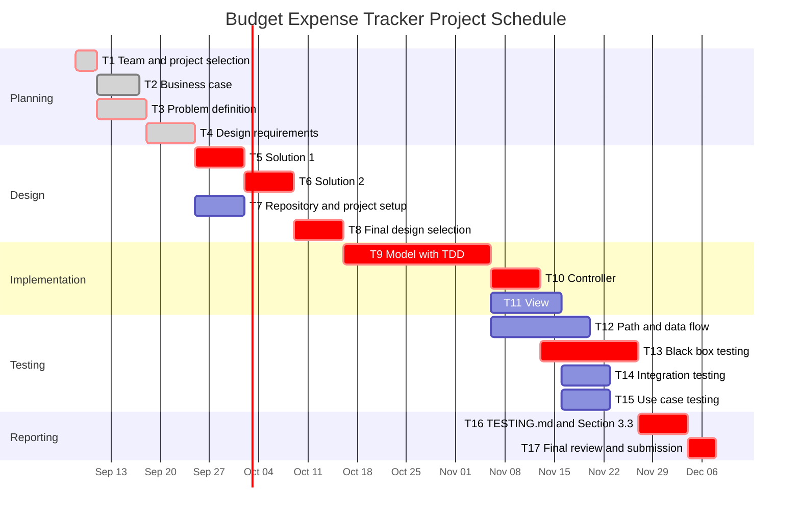

# ENSE 375 Software Testing and Validation

## Budget Expense Tracker

**Team Members**

| Name | UofR ID |
| --- | --- |
| Thomas Persson | 200525550 |
| Aldan Henry | 200533636 |
| Wei Wen Darren Liow | 200569702 |

---

## Table of Contents

1. [Introduction](#1-introduction)
2. [Design Problem](#2-design-problem)
   - [2.1 Problem Definition](#21-problem-definition)
   - [2.2 Design Requirements](#22-design-requirements)
3. [Solution](#3-solution)
4. [Team Work](#4-team-work)
5. [Project Management](#5-project-management)
6. [Conclusion and Future Work](#6-conclusion-and-future-work)
7. [References](#7-references)
8. [Appendix](#8-appendix)

---

## 1 Introduction

Managing money is a skill that many students are forced to learn very quickly. Starting university is often the first time a person becomes responsible for their own rent, groceries, transportation and tuition, and this usually happens while living on a fixed amount of money drawn from student loans, savings and a job held during the term. Because that money arrives in a few large deposits but leaves in many small amounts, it is difficult to judge how much is actually left for a given kind of spending until the money is already gone.

The traditional answer to this problem is a budget, which divides the available money into categories, gives each category a spending limit, and records expenses against those limits. Budgeting on paper or in a spreadsheet does work, but it depends entirely on the discipline of the user and it gives no warning as a limit is approached. Commercial budgeting applications automate the arithmetic instead, yet many of them require an account, display advertisements, charge a subscription fee, or store personal financial data on servers that the user does not control.

This project therefore proposes a Budget Expense Tracker, which is a small application that allows a user to create spending categories with limits, record expenses against those categories, see the remaining funds at any time, and receive a warning as a limit is approached or passed. The application is developed with test driven development, and it is organized using the Model View Controller architecture so that the logic can be tested apart from the interface. Its correctness is then established through a test suite that covers path, data flow, integration, boundary value, equivalence class, decision table, state transition and use case testing.

The remainder of this report is organized as follows. Section 2 defines the design problem, and it includes both the problem statement and the functions, objectives and constraints of the design. Section 3 then presents the solutions that the team considered, along with the final design that was chosen. After that, Section 4 documents the meetings of the team and the distribution of tasks, while Section 5 describes the schedule of the project. Finally, Section 6 concludes the report and outlines the work that could follow it.

---

## 2 Design Problem

### 2.1 Problem Definition

Students entering university typically manage their own money for the first time, and they must make a limited and largely fixed amount cover several separate kinds of spending, such as rent, groceries, transportation, tuition and personal expenses. Spending happens in many small transactions spread across a term, whereas income arrives in a small number of large deposits. As a result, a student can still have money in their account while having already overspent in one category that has to last until the next deposit arrives. Overspending in one category quietly takes money away from another, and the consequence is usually discovered at the end of the month, which is far too late to change the behaviour that caused it.

The tools that students have today do not solve this problem well. Recording expenses on paper or in a spreadsheet forces the user to build and maintain the categories and the arithmetic without help, and it gives no feedback at all until the user sits down and works the numbers out, so the habit is easily abandoned. Commercial budgeting applications do automate the tracking, yet they introduce costs of a different kind, because they commonly ask the user to create an account, connect a bank account, accept advertisements, or pay a subscription, and they place personal financial data on servers outside the control of the user. In addition, these applications are built for a general audience, so they carry far more features than a student with a handful of categories actually needs.

**Problem statement.**

No simple tool exists that is free to use, keeps financial data private, and allows a student to set spending limits for a small number of budget categories, record expenses against those categories with very little effort, see at any time how much money remains in each one, and receive a warning before a limit is passed rather than afterwards.

The design problem addressed by this project is therefore to design, build and thoroughly test a small desktop application that holds a set of budget categories and their spending limits, records expenses against those categories, keeps the remaining balance of each category up to date as expenses are added, and warns the user when a category is near its limit or beyond it. Because the purpose of the tool is to be trusted with financial decisions, the correctness of the balance and warning logic is not optional. The application must behave correctly for valid input, it must reject invalid input safely, and it must produce the right warning for every combination of conditions. Establishing that correctness through a systematically designed test suite is the main objective of this project, and for that reason the design is judged on how easily its parts can be isolated, controlled and observed by tests, just as much as on the features it offers.

The scope of the problem is deliberately limited so that the work fits within a design and development period of roughly two months. Consequently, the application serves one user, it stores its data on the local machine, and it does not connect to a bank, import transactions automatically, handle more than one currency, or offer forecasting or investment features.

### 2.2 Design Requirements

The design requirements are divided into three groups. The functions describe what the application does, the objectives describe how well it does those things, and the constraints set the limits that any acceptable design must stay within. Every requirement is written so that a test or an inspection can decide whether it has been met.

#### 2.2.1 Functions

| ID | Function |
| --- | --- |
| F1 | Create a budget category with a name and a spending limit. |
| F2 | Change the limit of an existing category, and delete a category that is no longer needed. |
| F3 | Record an expense with an amount, a date, a category and an optional description. |
| F4 | Edit or delete an expense that was recorded earlier. |
| F5 | Subtract each saved expense from the remaining funds of its category, and restore those funds when the expense is edited or deleted. |
| F6 | Display every category together with its limit, the amount spent so far and the funds that remain. |
| F7 | Warn the user when the spending in a category reaches 80 percent of its limit, and warn the user again when the limit is exceeded. |
| F8 | Validate every entry before it is saved, and reject an amount that is not a number, an amount that is zero or negative, an invalid date, and an expense without a category. |
| F9 | List the recorded expenses and filter that list by category or by date. |
| F10 | Save all categories and expenses to a file on the local machine, and load them again when the application starts. |

#### 2.2.2 Objectives

| ID | Objective | Metric |
| --- | --- | --- |
| O1 | Correct | Every calculation test in the suite passes. |
| O2 | Testable | Statement coverage of the model and controller code, measured with a coverage tool, is 90 percent or higher. |
| O3 | Robust | No invalid input class in the equivalence class tests causes an exception or changes a stored balance. |
| O4 | Simple | An expense can be recorded in three steps or fewer from the main screen. |
| O5 | Private | The application makes zero network connections during a full test run. |
| O6 | Responsive | The display updates within one second of saving an expense with 1000 expenses already stored. |
| O7 | Maintainable | Every public class and method has a comment, and the model, view and controller are kept in separate packages. |

#### 2.2.3 Constraints

Each constraint below is binary, which means that the final design either satisfies it or fails it. The last column explains how the team will check whether the constraint holds.

| ID | Category | Constraint | Verification |
| --- | --- | --- | --- |
| C1 | Economic | The application shall be built only with free tools and libraries, such as Java and JUnit, and it shall cost the user nothing to install or use. | Inspect the list of dependencies and confirm that none of them requires payment. |
| C2 | Regulatory compliance, covering security and access | The application shall store all financial data only on the local machine, it shall not require an account, and it shall not open any network connection. | Search the source code for network calls, and monitor network activity while the full test suite runs. |
| C3 | Reliability | Every test case in the suite shall pass before a version is released, and no rejected input shall change a stored balance. | Run the full JUnit suite and confirm that it reports zero failures. |
| C4 | Ethics | The application shall contain no advertisements and no tracking, it shall not collect any information about the user, and it shall not share any data with third parties. | Inspect the source code and the dependency list for advertising, analytics or tracking libraries, and confirm that no data leaves the machine. |
| C5 | Societal impact | The application shall run on Windows and Linux using only a free Java runtime, so that any student with an ordinary laptop can use it. | Launch the application and complete one use case on both operating systems. |
| C6 | Sustainability and environmental factors | The application shall run entirely on the machine of the user, and it shall not depend on any server, whether local or remote. | Review the architecture and confirm that it contains no server component. |

---

## 3 Solution

### 3.1 Solution 1

*To be completed for the October 8 deliverable.*

### 3.2 Solution 2

*To be completed for the October 8 deliverable.*

### 3.3 Final Solution

*To be completed for the December 3 deliverable.*

#### 3.3.1 Components

#### 3.3.2 Environmental, Societal, Safety, and Economic Considerations

#### 3.3.3 Test Cases and Results

#### 3.3.4 Limitations

---

## 4 Team Work

### 4.1 Meeting 1

| | |
| --- | --- |
| **Time** | Thursday, September 10, 2026, from 3.30 pm to 4.30 pm |
| **Agenda** | Selection of the project and distribution of the first tasks |

| Team Member | Previous Task | Completion State | Next Task |
| --- | --- | --- | --- |
| Thomas Persson | N/A | N/A | Write the Introduction and the Problem Definition, Section 2.1 |
| Aldan Henry | N/A | N/A | Create the GitHub repository and research existing budgeting apps |
| Wei Wen Darren Liow | N/A | N/A | Write the business case |

### 4.2 Meeting 2

| | |
| --- | --- |
| **Time** | Friday, September 18, 2026, from 3.30 pm to 4.30 pm |
| **Agenda** | Review of the business case and Section 2.1, and distribution of the tasks for Section 2.2 |

| Team Member | Previous Task | Completion State | Next Task |
| --- | --- | --- | --- |
| Thomas Persson | Write the Introduction and the Problem Definition, Section 2.1 | 100% | Write the Constraints, Section 2.2.3 |
| Aldan Henry | Create the GitHub repository and research existing budgeting apps | 100% | Build the Gantt chart and the schedule, Section 5 |
| Wei Wen Darren Liow | Write the business case | 100% | Write the Functions and Objectives, Sections 2.2.1 and 2.2.2 |

### 4.3 Meeting 3

*To be completed.*

### 4.4 Meeting 4

*To be completed.*

---

## 5 Project Management

The Gantt chart below shows every task on a timeline, with finished tasks shaded and the tasks on the critical path marked in red.

The table below lists the same tasks with their predecessors, their duration and their slack. Slack is the number of days a task can be delayed without delaying the final submission, so a task with zero slack lies on the critical path.

| ID | Task | Predecessors | Duration | Slack | Status |
| --- | --- | --- | --- | --- | --- |
| T1 | Form the team and select the project | None | 3 days | 0 days | Complete |
| T2 | Write the business case | T1 | 6 days | 1 day | Complete |
| T3 | Write the problem definition, Section 2.1 | T1 | 7 days | 0 days | Complete |
| T4 | Write the design requirements, Section 2.2 | T2, T3 | 7 days | 0 days | Complete |
| T5 | Design Solution 1, Section 3.1 | T4 | 7 days | 0 days | Not started |
| T6 | Design Solution 2, Section 3.2 | T5 | 7 days | 0 days | Not started |
| T7 | Set up the repository, the Java project and JUnit | T4 | 7 days | 14 days | Not started |
| T8 | Select the final design, Solution 3 | T6 | 7 days | 0 days | Not started |
| T9 | Implement the model with test driven development | T7, T8 | 21 days | 0 days | Not started |
| T10 | Implement the controller | T9 | 7 days | 0 days | Not started |
| T11 | Implement the view | T9 | 10 days | 4 days | Not started |
| T12 | Path and data flow testing | T9 | 14 days | 7 days | Not started |
| T13 | Boundary value, equivalence class, decision table and state transition testing | T10 | 14 days | 0 days | Not started |
| T14 | Integration testing | T10, T11 | 7 days | 4 days | Not started |
| T15 | Use case testing | T11 | 7 days | 4 days | Not started |
| T16 | Write TESTING.md and Section 3.3 | T12, T13, T14, T15 | 7 days | 0 days | Not started |
| T17 | Final review and submission | T16 | 4 days | 0 days | Not started |

The critical path is therefore T1, T3, T4, T5, T6, T8, T9, T10, T13, T16 and T17. Any delay to one of these tasks moves the final submission by the same amount, so the team reviews its progress on these tasks at every weekly meeting.

---

## 6 Conclusion and Future Work

*To be completed.*

---

## 7 References

*The IEEE reference style is used, and only the references cited in the text are listed.*

---

## 8 Appendix

*Additional information, if any is needed.*

